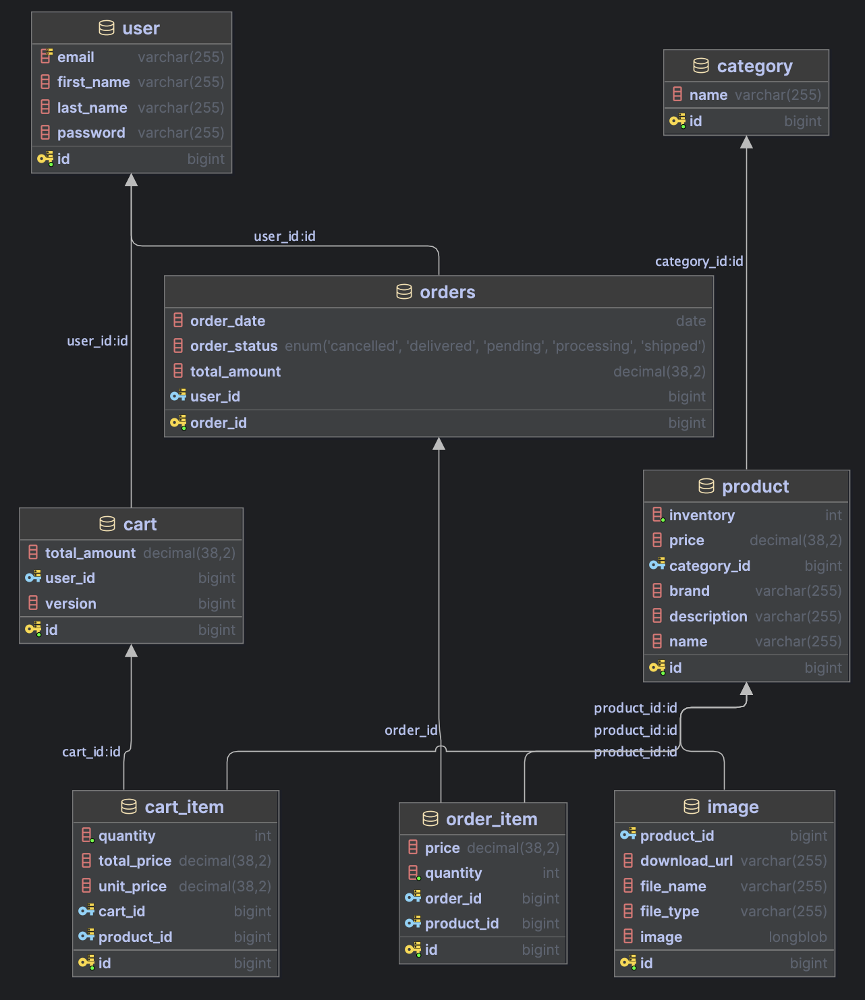

# TrendMart E-commerce Platform

## 📋 Project Overview
TrendMart is a full-featured e-commerce platform built with Spring Boot, offering a complete online shopping experience. The application provides RESTful APIs for user management, product catalog, shopping cart, and order processing.

## ✨ Features

### User Management
- User registration and authentication
- User profile management
- Order history tracking

### Product Catalog
- Product browsing and search
- Product categorization
- Product images and details

### Shopping Cart
- Add/remove items from cart
- Update quantities
- Cart persistence across sessions

### Order Processing
- Secure checkout process
- Order history and tracking
- Order status updates

## 🛠 Tech Stack

### Backend
- **Java 17**
- **Spring Boot 3.x**
- **Spring Security**
- **Spring Data JPA**
- **Hibernate**
- **Maven**

### Database
- **MySQL 8.0+** (primary database)
- **H2** (for testing)

### API Documentation
- **Swagger/OpenAPI**
- **Postman** collection available

## 🚀 Getting Started

### Prerequisites
- Java 17 or higher
- Maven 3.6.3 or higher
- MySQL 8.0 or higher
- Git

### Installation

1. **Clone the repository**
   ```bash
   git clone https://github.com/yourusername/trendmart.git
   cd trendmart
   ```

2. **Configure database**
   - Create a new MySQL database
   - Update `application.properties` with your database credentials (username, password, and database name)

3. **Build the application**
   ```bash
   mvn clean install
   ```

4. **Run the application**
   ```bash
   mvn spring-boot:run
   ```

5. **Access the application**
   - API Documentation: `http://localhost:8080/swagger-ui.html`
   - Application: `http://localhost:8080`

## 📚 API Documentation

### Authentication
- `POST /api/v1/auth/register` - Register a new user
- `POST /api/v1/auth/login` - Authenticate user

### Users
- `GET /api/v1/users/{userId}` - Get user details
- `PUT /api/v1/users/{userId}` - Update user profile
- `DELETE /api/v1/users/{userId}` - Delete user account

### Products
- `GET /api/v1/products` - Get all products
- `GET /api/v1/products/{productId}` - Get product details
- `POST /api/v1/products` - Add new product (Admin only)
- `PUT /api/v1/products/{productId}` - Update product (Admin only)
- `DELETE /api/v1/products/{productId}` - Delete product (Admin only)

### Cart
- `GET /api/v1/cart` - Get user's cart
- `POST /api/v1/cart/items` - Add item to cart
- `PUT /api/v1/cart/items/{itemId}` - Update cart item quantity
- `DELETE /api/v1/cart/items/{itemId}` - Remove item from cart

### Orders
- `GET /api/v1/orders` - Get user's orders
- `POST /api/v1/orders` - Create new order
- `GET /api/v1/orders/{orderId}` - Get order details

## 🗄 Database Schema

Here's the database schema for the TrendMart application:



### Entity Relationships

- **User** - Stores user information and authentication details
- **Product** - Product catalog with details like name, price, and inventory
- **Category** - Product categories and subcategories
- **Cart** - Shopping cart associated with each user
- **CartItem** - Individual items in a shopping cart
- **Order** - Order information including status and timestamps
- **OrderItem** - Items included in each order
- **Role** - User roles and permissions
- **User_Roles** - Join table for user-role many-to-many relationship

## 🔒 Environment Configuration

### 1. Environment Variables Setup

Create a `.env` file in the root directory of the project with the following configuration:

```env
# ===== Database Configuration =====
# Database connection URL
# Format: jdbc:mysql://[host]:[port]/[database]?[parameters]
DB_URL=jdbc:mysql://localhost:3306/trendmart?createDatabaseIfNotExist=true&useSSL=false&serverTimezone=UTC

# Database credentials
DB_USERNAME=your_mysql_username
DB_PASSWORD=your_mysql_password

# ===== JWT Configuration =====
# Secret key for JWT token signing (use a strong, unique key in production)
# Generate a secure key: `openssl rand -base64 32`
JWT_SECRET=your_secure_jwt_secret_key_here

# JWT token expiration time in milliseconds (default: 24 hours)
JWT_EXPIRATION_MS=86400000

# ===== Application Settings =====
# Server port (default: 8080)
SERVER_PORT=8080

# Logging level (DEBUG, INFO, WARN, ERROR)
LOGGING_LEVEL=INFO

# CORS allowed origins (comma-separated)
# Example: http://localhost:3000,http://localhost:4200
CORS_ALLOWED_ORIGINS=*
```

### 2. Required Software

Before running the application, ensure you have the following installed:

- **MySQL 8.0+**
  - Download: [MySQL Community Server](https://dev.mysql.com/downloads/mysql/)
  - Create a new database named `trendmart`
  - Note down your MySQL credentials

- **Java 17 JDK**
  - Download: [OpenJDK 17](https://adoptium.net/)
  - Verify installation: `java -version`

- **Maven 3.6.3+**
  - Download: [Maven](https://maven.apache.org/download.cgi)
  - Verify installation: `mvn -v`

### 3. Configuration Steps

1. **Database Setup**
   - Install MySQL if not already installed
   - Create a new database:
     ```sql
     CREATE DATABASE trendmart CHARACTER SET utf8mb4 COLLATE utf8mb4_unicode_ci;
     ```
   - Create a MySQL user with appropriate privileges

2. **Environment File**
   - Copy the example configuration above to a new file named `.env` in the project root
   - Update the following values:
     - `DB_USERNAME`: Your MySQL username
     - `DB_PASSWORD`: Your MySQL password
     - `JWT_SECRET`: Generate a secure random string
     - Adjust other values as needed for your environment

3. **Build and Run**
   ```bash
   # Install dependencies
   mvn clean install
   
   # Run the application
   mvn spring-boot:run
   ```

### 4. Testing the Configuration

After starting the application, you can test the setup:

1. Access Swagger UI: http://localhost:8080/swagger-ui.html
2. Try registering a new user via `/api/v1/auth/register`
3. Test authentication with `/api/v1/auth/login`

### 5. Production Considerations

For production deployment:
1. Change `JWT_SECRET` to a strong, randomly generated value
2. Set `createDatabaseIfNotExist=false` in the DB_URL
3. Configure proper SSL/TLS for database connections
4. Set appropriate logging levels
5. Configure proper CORS settings
6. Use environment-specific profiles (e.g., `application-prod.yml`)

## 🧪 Running Tests

```bash
# Run all tests
mvn test

# Run specific test class
mvn test -Dtest=YourTestClass

# Run with coverage
mvn jacoco:report
```

## 🤝 Contributing

1. Fork the repository
2. Create your feature branch (`git checkout -b feature/AmazingFeature`)
3. Commit your changes (`git commit -m 'Add some AmazingFeature'`)
4. Push to the branch (`git push origin feature/AmazingFeature`)
5. Open a Pull Request

## 📄 License

This project is licensed under the MIT License - see the [LICENSE](LICENSE) file for details.

## 🙏 Acknowledgments

- [Spring Boot](https://spring.io/projects/spring-boot)
- [Hibernate](https://hibernate.org/)
- [MySQL](https://www.mysql.com/)
- [Maven](https://maven.apache.org/)
